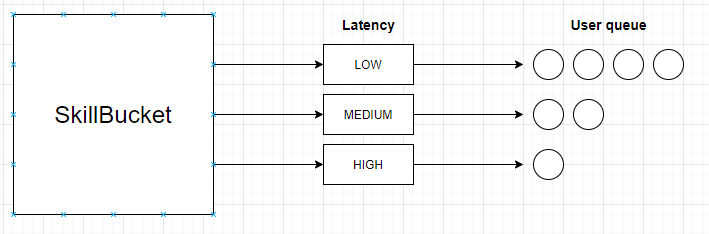
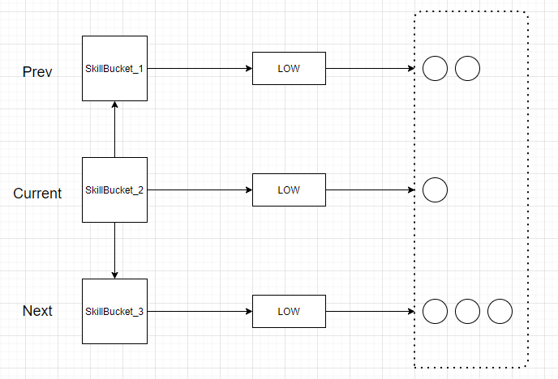

# Simple match making service

## Application API

> By default, application is running on 8080 port

|Method|URL|Payload|Description|
|---|---|---|---|
|POST|/users|<code>{<br>  "name": "name",<br>  "skill": 1.11,<br>  "latency": 23.3<br>}</code>|Adds specified user to match pool|
|POST|/users/generate/{count}| |Adds {count} random generated users to match pool|

## Solution



#### User registration

1. SkillBucket is calculated by user's skill. In current app SkillBucket defines range of skills.
   For example, from 0 to 2
2. Latency type is calculated by user's latency.
3. User is added to the queue (with registration time priority) that is related to bucket and latency

#### Match making



For each SkillBucket and latency type in it:
 
- Defining user queue size. In case when it is more than `groupSize`, possible groups are created from taking elements from current queue, otherwise
- Going to next SkillBucket and taking into account the queue with the same latency type.
  In this case sum of queue sizes are calculated and in case it is greater than `groupSize`
  all users in queue for current bucket are taken and rest are taken from queue of next bucket, otherwise
- Going also to prev bucket queue for the same latency and check for possibility to create group

> Solution will work in cases where users amount is much more than `groupSize` and level difference between users

> To change `groupSize` it is necessary to update in application.yml 
> ```yml
> application:
>   match:
>     groupSize: 8
> ```